# Dimba Itambe Admin

## Description
Dimba Itambe Admin is an admin panel for managing articles, teams, players, fixtures etc in a football league application.

## Features
- User authentication
- Article management
- Team and player management
- Fixture management
- Football video highlights management
- Careers management
- League standings management

## Technology Stack

- **Backend**: Node.js, Express.js
- **Frontend**: Html, CSS, Bootstrap, EJS templates
- **Database**: PostgreSQL

## Dependencies
- bcrypt
- body-parser
- dotenv
- ejs
- express
- express-session
- passport
- passport-local
- pg

## Demo
For a video demonstration click [here](https://youtu.be)

## 1. Log in
In order to access the admin side system, the admin needs to login.
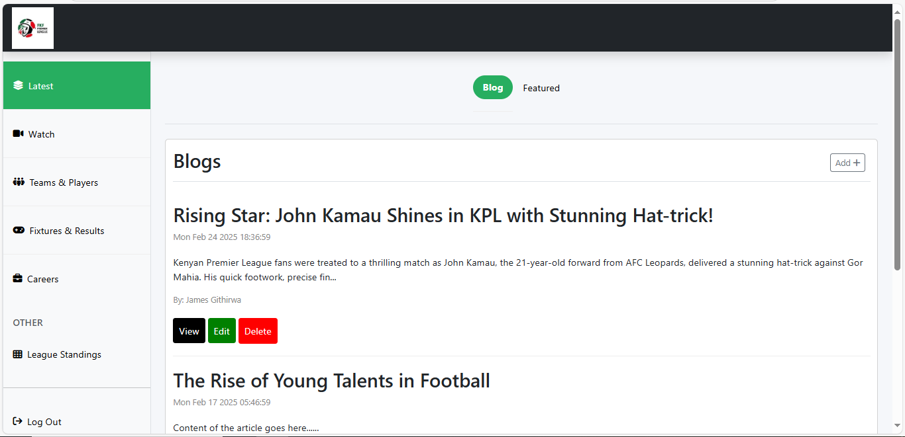

## 2. Home Page
The home page features the latest football updates. It has three parts:
### 2.1 Latest article blogs section
Displays articles added in the database. Allows for adding, editing, deleting and viewing added articles.

#### 2.1.1 Add blogs 
To add an article/blog click "Add +" button at the top right of the blogs card. 
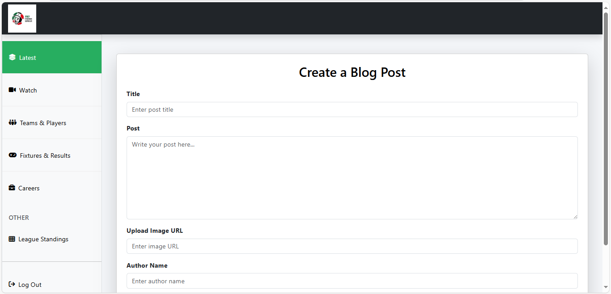
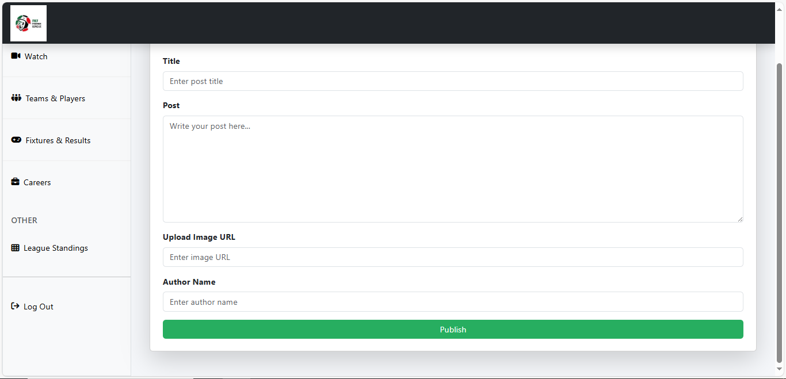

Enter article details and click "Publish" to add the article.

#### 2.1.2 Read blogs 
To read an article click "read View" button on the specific blog. Below is a sample article view:
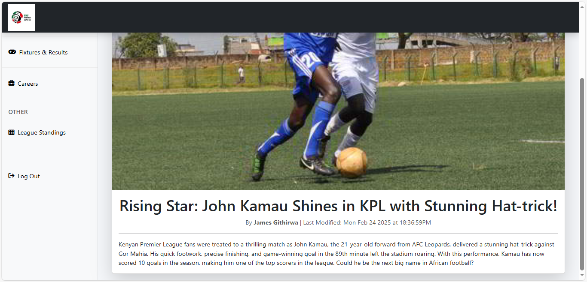

#### 2.1.3 Edit blogs 
To add an article/blog click "Edit" button on the specific blog. 
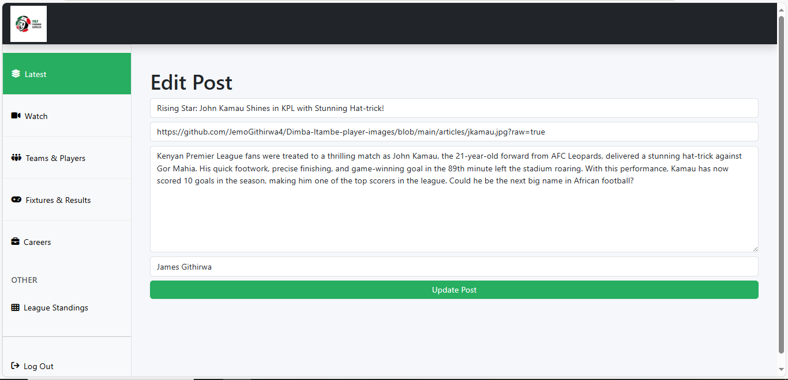

Enter update text and click "Update Post" to complete the update.

#### 2.1.4 Delete blogs 
To delete an article/blog click "Delete" button on the specific blog.

### 2.2 Update featured players
This selects three players at random to feature players on the main Dimba Itambe Web application. See [here](https://github.com/JemoGithirwa4/Dimba-Itambe).
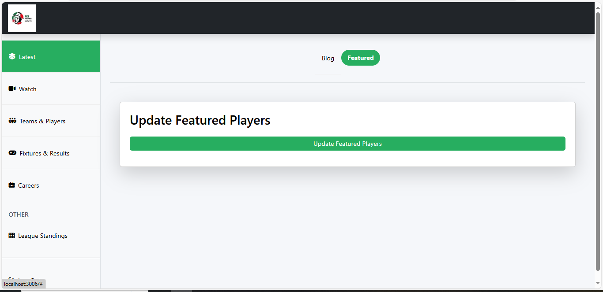

## 3. Watch Page
The watch page is for managing video highlights for played games.
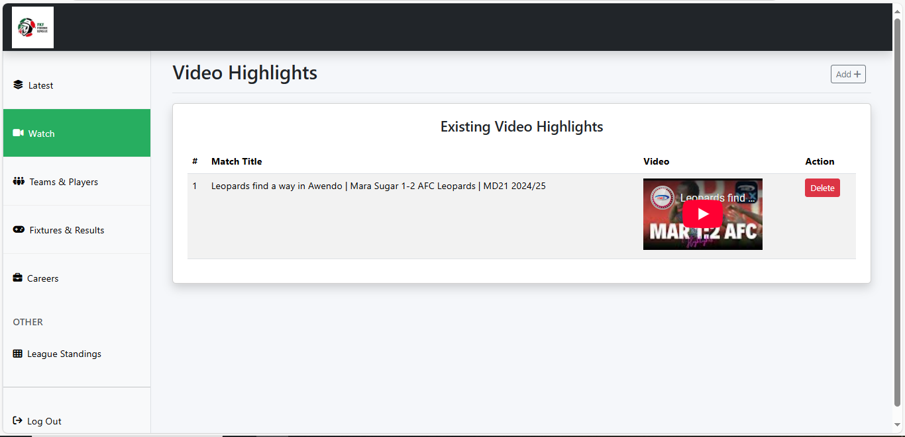

### 3.1 Video highlight 
To add an article/blog click "Add +" button at the top right. 
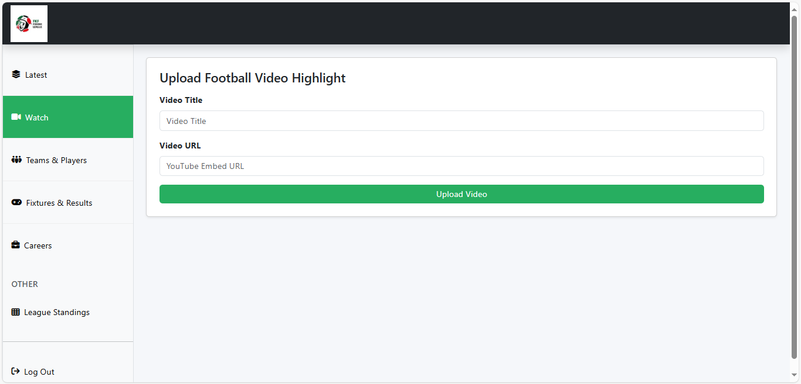

Enter video details as specified and click "Upload Video" to add the video.

### 3.2 Delete video highlight
To delete video highlight just click the "Delete" button on the specific video row.

## 4. Teams & Players Page
The page handles teams and players information management. It has three parts:
### 4.1 Teams section
Displays existing teams on the database. Allows for adding, editing, deleting teams.
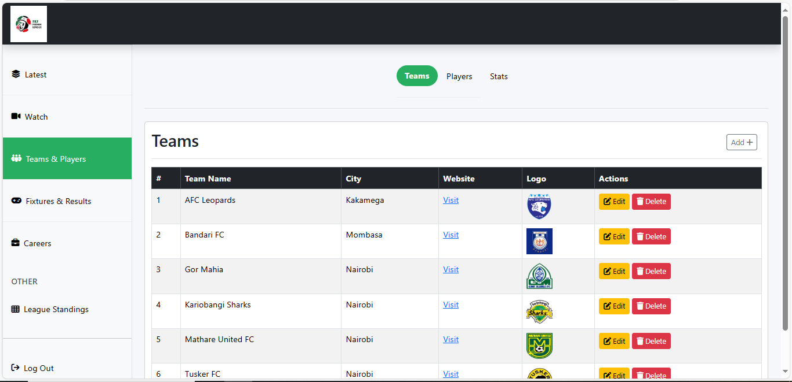

#### 4.1.1 Add Team 
To add a team click "Add +" button at the top right of the teams card. 
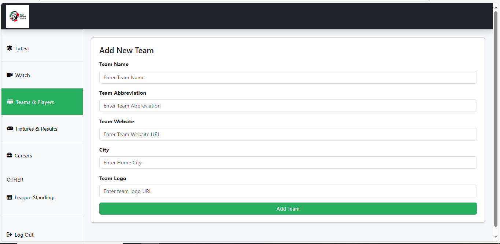

Enter team details and click "Add Team" to add the team.

#### 4.1.2 Edit Team 
To edit a team click "Edit" button on the specific team. 
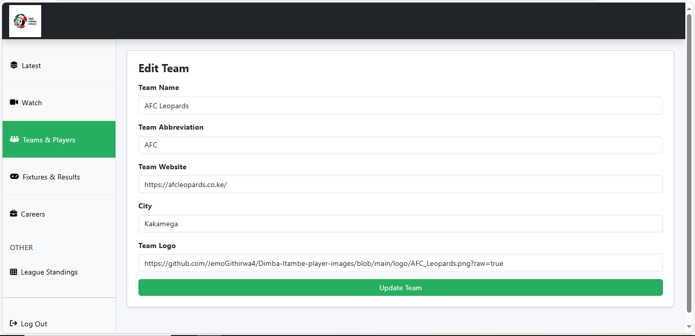

Enter the updates and click "Update Team".

#### 4.1.3 Delete Team
To delete a team click "Delete" button on the specific team row.

### 4.2 Players Section
This is where player information is managed.
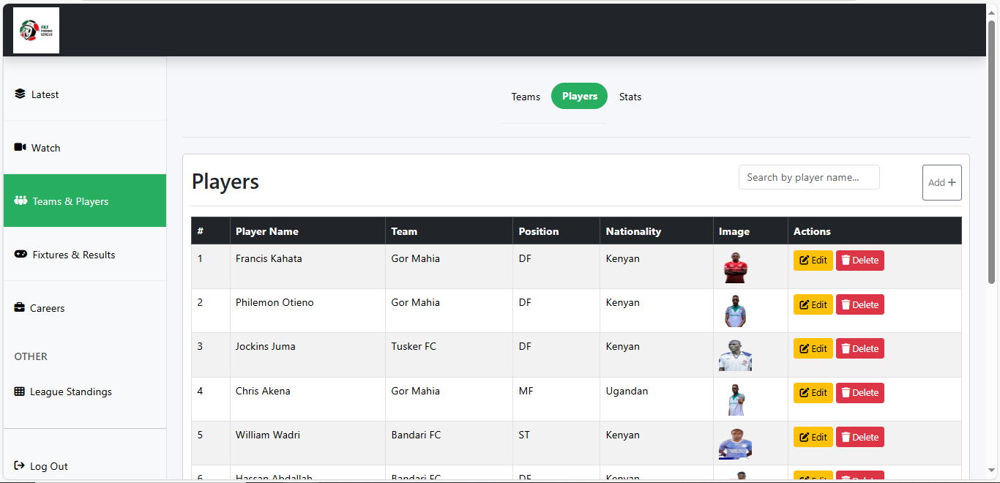

#### 4.2.1 Add Player
To add a player click "Add +" button at the top right of the players card. 
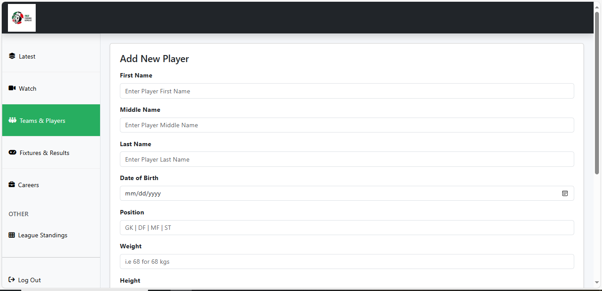
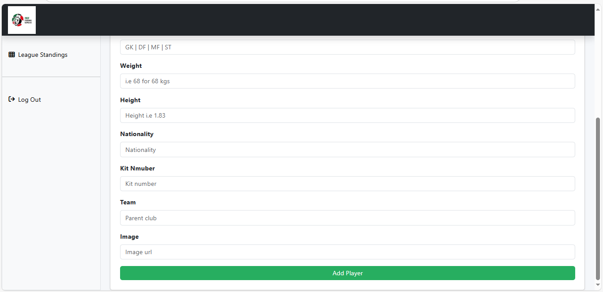

Enter player details and click "Add Player" to add the player.

#### 4.2.2 Edit Player
To edit a player click "Edit" button on the specific player. 
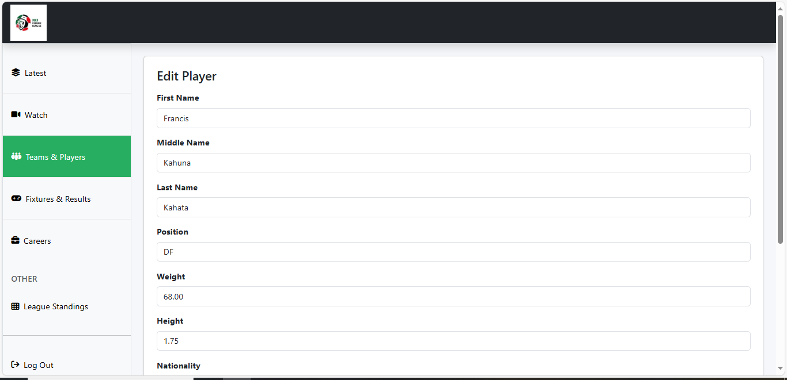
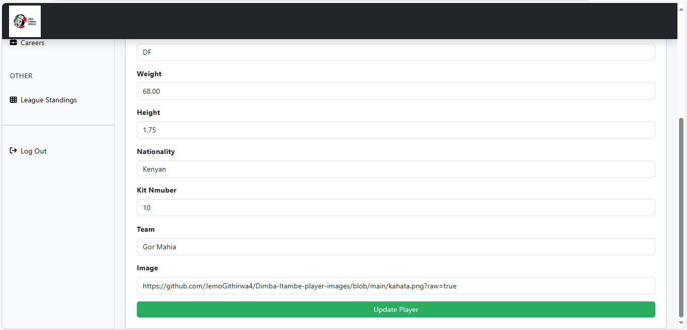

Enter the updates and click "Update Player".

#### 4.2.3 Delete Team
To delete a team click "Delete" button on the specific team row.

### 4.3 Stats Section
This is where player statistics information is managed.
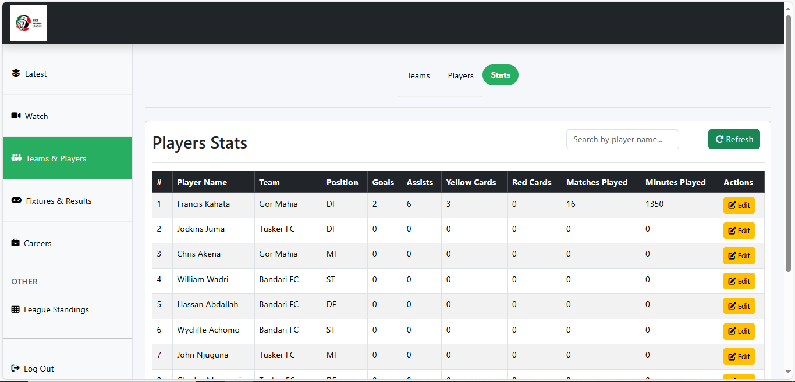

#### 4.3.1 Add Stats
To add a new player record click "Refresh" button at the top right of the stats card. This updates the stats view to include any newly added players. 

#### 4.3.2 Edit Player Stats
To edit a player stats click "Edit" button on the specific player. 
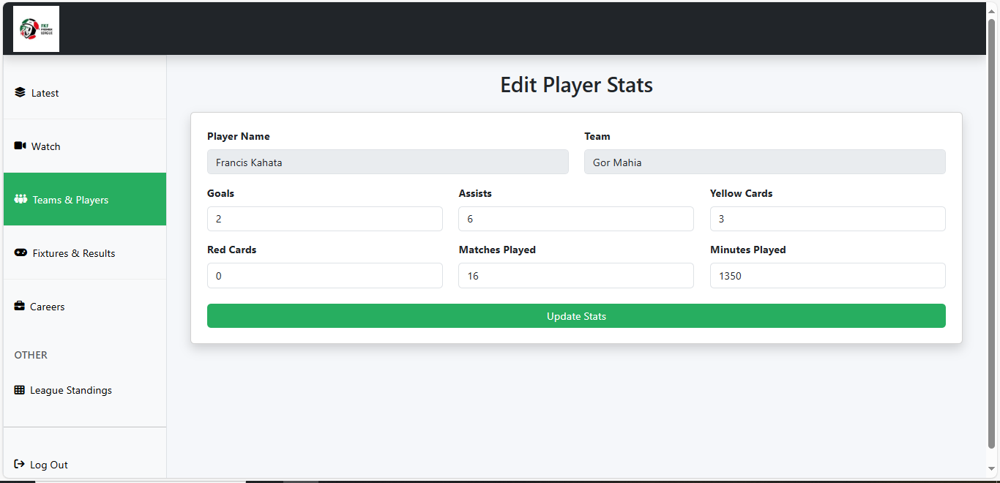

Enter the updates and click "Update Stats".